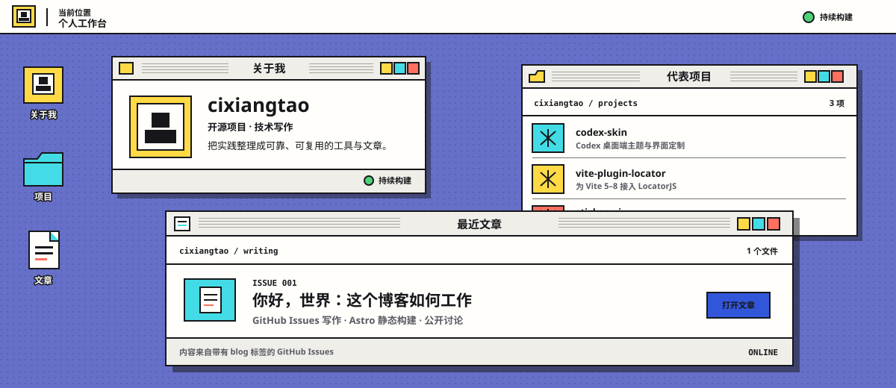

<!--
THESIS: README 是个人工作台的静态入口，拒绝与 Pages 脱节的通用开发者主页。
OWN-WORLD: 紫蓝点阵桌面、直角纸白窗口、一像素墨线、硬阴影，以及青黄珊瑚状态色。
STORY: 访客先认识作者，再通过真实项目与文章确认技术方向，最后进入 Pages 或 GitHub 继续浏览。
FIRST VIEWPORT: 一张横向工作台封面同时呈现关于我、代表项目和最近文章，正文入口紧随其后。
FORM: 继承 Pages 的彩色个人工作台，以静态 SVG 封面配合 GitHub 原生 Markdown；这是既有世界的窄范围适配，seed: inherited-world/no-roll。
FINISH: unreviewed and undocumented is unfinished; this build ends with the finish review, the verdict, and DESIGN.md
-->

  <picture>
    <source media="(max-width: 700px)" srcset="./.github/assets/profile-workbench-mobile.svg" />
    
  </picture>

**前端工程师 · 开源项目维护者 · 技术写作者**

把复杂问题整理成清晰、可靠、可复用的产品与工具。

[打开个人工作台](https://cixiangtao.github.io/cixiangtao/) · [阅读技术文章](https://github.com/cixiangtao/cixiangtao/issues?q=is%3Aissue%20label%3Ablog) · [查看全部项目](https://github.com/cixiangtao?tab=repositories)

## 关于我

我是一名前端工程师，常驻北京。日常主要使用 TypeScript、React、Vue、Vite 和 Node.js，也会持续关注开发体验、类型安全、可维护性与界面细节。

这里既是我的 GitHub 主页，也是个人工作台的入口：项目记录我正在构建的东西，文章保存实践过程、设计取舍与阶段复盘。

## 代表项目

| 项目 | 解决什么问题 | 入口 |
| --- | --- | --- |
| [codex-skin](https://github.com/cixiangtao/codex-skin) | 为 macOS 上的 Codex 桌面端提供主题与界面定制 | [网站](https://cixiangtao.github.io/codex-skin/) |
| [nice-use-modal](https://github.com/cixiangtao/nice-use-modal) | 类型安全、无头的 React 弹窗控制器，提供明确的显示、隐藏与销毁生命周期 | [演示](https://cixiangtao.github.io/nice-use-modal/) · [npm](https://www.npmjs.com/package/nice-use-modal) |
| [url-join](https://github.com/cixiangtao/url-join) | 零依赖的 TypeScript URL 拼接工具，支持空值过滤、协议保护与查询参数 | [npm](https://www.npmjs.com/package/@anys/url-join) |
| [acer-almanac](https://github.com/cixiangtao/acer-almanac) | 确定性的中国黄历工具集，包含 TypeScript 包、Web Component、浏览器扩展与在线演示 | [演示](https://cixiangtao.github.io/acer-almanac/) · [npm](https://www.npmjs.com/package/acer-almanac) |
| [vite-plugin-locator](https://github.com/cixiangtao/vite-plugin-locator) | 一行配置，为 Vite 5–8 接入 LocatorJS | [npm](https://www.npmjs.com/package/vite-plugin-locator) |
| [sticker-ui](https://github.com/cixiangtao/sticker-ui) | 手册贴纸风格的 React 与 Tailwind CSS 组件库和源码注册表 | [预览](https://cixiangtao.github.io/sticker-ui/) |
| [skills](https://github.com/cixiangtao/skills) | 面向开发工作流的可复用 Agent Skills，强调明确的执行步骤与验证边界 | [仓库](https://github.com/cixiangtao/skills) |

## 最近文章

文章发布在带有 `blog` 标签的 GitHub Issues 中，再由 Astro 在构建阶段生成静态页面。写作保留熟悉的 Markdown 与 GitHub 讨论体验，访客打开网站时不需要实时请求 GitHub API。

**[你好，世界：这个博客如何工作 →](https://cixiangtao.github.io/cixiangtao/posts/1/)** 
这个博客的第一篇文章，也是从 GitHub Issues 到静态网站整条发布链路的起点。

[进入文章窗口](https://cixiangtao.github.io/cixiangtao/#writing) · [打开文章档案](https://github.com/cixiangtao/cixiangtao/issues?q=is%3Aissue%20label%3Ablog)

## 工具箱

  

持续好奇，认真交付。

